# Vote API

API REST para gerenciar sessões de votação em assembleias de cooperativismo — cada associado
tem um voto e vota uma única vez por pauta. O **foco** da solução é a comunicação **server-driven**
com o app mobile: o backend devolve mensagens JSON (telas) que o cliente interpreta para montar a
interface (Anexo 1). A aplicação cliente não faz parte deste projeto — apenas o servidor.

**Stack:** Java 21 · Spring Boot 4.1 · Spring Web MVC · Spring Data JPA · PostgreSQL · Flyway ·
Resilience4j · springdoc-openapi · Micrometer/Actuator · Arquitetura Limpa.

---

## 0. Ressalva técnica

Eu segui exatamente o que foi pedido na documentação, olhando para a necessidade do mobile e fazendo
o suficiente para que a integração fosse bem-sucedida. Mas, em cenários diferentes, onde não
tivéssemos essa limitação do mobile, poderíamos pensar em uma arquitetura mais resiliente,
provavelmente baseada em eventos. Assim, poderíamos ter mais desempenho, confiabilidade e resiliência
na aplicação, apesar de que, com os testes realizados em ambiente local (ver seções 8 e 11), o
desempenho já se mostrou aceitável.

Mesmo seguindo com essa arquitetura, em cenários de evolução da solução poderíamos fazer ajustes para
melhorar o desempenho, como adicionar uma camada de Kubernetes/API Gateway para criar uma base mais
confiável em cenários de escala horizontal.

---

## 1. Como executar

Três modos (nenhum exige passo manual de banco):

**a) Docker Compose — tudo em container, um comando** — production-like local. A **app roda dentro
de um container** (build da imagem), junto de Postgres, Redis, Prometheus e Grafana:
```bash
docker compose -f docker-compose.app.yml up --build
# API:        http://localhost:8090
# Swagger:    http://localhost:8090/swagger-ui.html
# Prometheus: http://localhost:9090
# Grafana:    http://localhost:3000  (admin/admin)
```
> A porta host **8090** foi escolhida para evitar o conflito comum na 8080. Para usar outra,
> edite `ports: ["8090:8080"]` em `docker-compose.app.yml`. Encerrar: `docker compose -f docker-compose.app.yml down`.

**b) Gradle — app no host + dependências e observabilidade automáticas** (requer Docker rodando):
```bash
./gradlew bootRun
```
Um único comando: o `spring-boot-docker-compose` sobe **Postgres, Redis, Prometheus e Grafana**
(via `compose.yaml`) e a **app roda no host** (é o próprio `bootRun`, com hot reload). O Prometheus
raspa a app do host por `host.docker.internal:8080`:
```
# API:        http://localhost:8080
# Swagger:    http://localhost:8080/swagger-ui.html
# Prometheus: http://localhost:9090
# Grafana:    http://localhost:3000  (admin/admin — dashboard "Vote API" + alertas provisionados)
```
> Aqui a app **não** é um container: o `bootRun` **é** a aplicação; o `compose.yaml` só provê as
> dependências. Encerrar as dependências: `docker compose -f compose.yaml down`.

**c) Sem Docker** (H2 em arquivo, fallback):
```bash
SPRING_PROFILES_ACTIVE=local-h2 ./gradlew bootRun   # app em http://localhost:8080
```

> **Elegibilidade de CPF:** o serviço oficial (`user-info.herokuapp.com`) retorna 404 para os
> CPFs testados, o que recusaria todo voto. Por isso o provider default é `sempre` (todo associado
> é elegível) e a app fica demonstrável. A integração real existe atrás de
> `vote.elegibilidade.provider=user-info` (ver §6).

Rodar os testes: `./gradlew test`

---

## 2. Documentação da API (Swagger)

- **Swagger UI:** `/swagger-ui.html`
- **OpenAPI JSON:** `/v3/api-docs`

Cada endpoint traz exemplos de sucesso **e** de erro.

### Endpoints de domínio (`/api/v1`)

| Método | Rota | Sucesso | Erros principais |
|---|---|---|---|
| POST | `/api/v1/pautas` | 201 + `Location` | 400 |
| POST | `/api/v1/pautas/{id}/sessoes` | 201 + `Location` | 400, 404, 409 |
| POST | `/api/v1/pautas/{id}/votos` | 201 | 400, 404, 409, 422, 503 |
| GET | `/api/v1/pautas/{id}/resultado` | 200 | 404, 409 |

### Catálogo de erros — ProblemDetail (RFC 7807)

Todo erro retorna `application/problem+json` com um `type` estável e `title`/`detail` de
`messages.properties`:

| `type` | HTTP | Quando |
|---|---|---|
| `urn:vote:validacao` | 400 | Bean Validation / JSON malformado / enum inválido / path não-UUID |
| `urn:vote:pauta-nao-encontrada` | 404 | pauta inexistente |
| `urn:vote:sessao-ja-aberta` | 409 | tentar abrir 2ª sessão na pauta |
| `urn:vote:voto-duplicado` | 409 | associado já votou na pauta |
| `urn:vote:sessao-fechada` | 422 | votar fora da janela |
| `urn:vote:sessao-em-andamento` | 409 | consultar resultado antes do fechamento |
| `urn:vote:associado-inelegivel` | 422 | serviço de CPF respondeu `UNABLE_TO_VOTE` (ou CPF inválido) |
| `urn:vote:elegibilidade-indisponivel` | 503 | serviço de CPF indisponível (fail-closed) |

---

## 3. Camada de telas (Anexo 1) — server-driven UI

**São endpoints JSON do backend, não uma UI.** O app mobile interpreta o JSON para montar as
telas. As `url` dos botões/itens apontam para endpoints reais e usam uma base-url configurável
(`vote.callback.base-url`, default `http://localhost:8080`).

Endpoints em `/api/v1/telas/**`:

| Rota | Tipo | Papel |
|---|---|---|
| GET `/menu` | SELECAO | menu inicial → nova pauta / ver pautas |
| GET `/pautas/nova` | FORMULARIO | cadastrar pauta |
| GET `/pautas` | SELECAO | lista de pautas |
| GET `/pautas/{id}` | SELECAO | ações da pauta (abrir sessão / votar / resultado) |
| GET `/pautas/{id}/sessao/nova` | FORMULARIO | abrir sessão |
| GET `/pautas/{id}/voto` | FORMULARIO | etapa 1 do voto (associadoId + cpf) |
| POST `/pautas/{id}/voto/opcoes` | SELECAO | etapa 2 (Sim/Não com o payload embutido) |
| GET `/pautas/{id}/resultado` | FORMULARIO | resultado (leitura) |

O **voto é em duas etapas**: o FORMULARIO coleta `associadoId`+`cpf` e seu `botaoOk` chama
`/voto/opcoes`, que devolve uma SELECAO cujas opções Sim/Não já trazem esses valores no `body` e
dão POST em `/api/v1/pautas/{id}/votos`.

**Exemplo — FORMULARIO** (`GET /api/v1/telas/pautas/nova`):
```json
{
  "tipo": "FORMULARIO",
  "titulo": "Nova pauta",
  "itens": [
    { "tipo": "INPUT_TEXTO", "id": "titulo",    "titulo": "Titulo",    "valor": "" },
    { "tipo": "INPUT_TEXTO", "id": "descricao", "titulo": "Descricao", "valor": "" }
  ],
  "botaoOk":      { "texto": "Confirmar", "url": "http://localhost:8080/api/v1/pautas", "body": {} },
  "botaoCancelar":{ "texto": "Cancelar",  "url": "http://localhost:8080/api/v1/telas/menu" }
}
```

**Exemplo — SELECAO** (`POST /api/v1/telas/pautas/{id}/voto/opcoes`):
```json
{
  "tipo": "SELECAO",
  "titulo": "Seu voto",
  "itens": [
    { "texto": "Sim", "url": "http://localhost:8080/api/v1/pautas/{id}/votos",
      "body": { "associadoId": "a1", "cpf": "19839091069", "opcao": "SIM" } },
    { "texto": "Nao", "url": "http://localhost:8080/api/v1/pautas/{id}/votos",
      "body": { "associadoId": "a1", "cpf": "19839091069", "opcao": "NAO" } }
  ]
}
```

---

## 4. Arquitetura

**Arquitetura Limpa** com a Dependency Rule imposta por 5 regras **ArchUnit** (o build falha se
violada). Dois surfaces HTTP: a API de domínio (`/api/v1/**`) e o BFF de telas (`/api/v1/telas/**`),
que compõe o domínio sem duplicar regra.

```
domain/model          entidades/VOs puros (@Builder), sem Spring/JPA. Clock injetável.
application/
  usecase             CadastrarPauta, AbrirSessao, RegistrarVoto, ConsultarResultado, ListarPautas
  port/out            VerificadorElegibilidade, {Pauta,Sessao,Voto}Repository  (interfaces)
  exception           exceções de negócio
adapters/
  web + web/telas     controllers, DTOs (records), ProblemDetail advice, telas (BFF)
  persistence         entidades JPA + Spring Data + adapters (mapeiam domínio↔JPA)
  gateway             SempreElegivel, UserInfoClient
config                properties, Clock, OpenAPI, correlation-id
```

Regra central: as portas vivem em `application`; os adapters as implementam. Entidade de domínio
≠ entidade JPA (mapeamento explícito).

---

## 5. Concorrência e unicidade

- `UNIQUE (pauta_id, associado_id)` no banco é o backstop da regra "um voto por associado".
  `UNIQUE (pauta_id)` faz o mesmo para "uma sessão por pauta".
- A violação de unicidade é traduzida em `409` (`VotoDuplicadoException` / `SessaoJaAbertaException`)
  via `saveAndFlush` + `DataIntegrityViolationException`.
- **Provado por teste:** `VotoConcorrenciaIT` — 50 threads votando pelo **mesmo** associado →
  **exatamente 1 voto** persistido (as 49 restantes recebem 409).

---

## 6. Elegibilidade de CPF (bônus 1)

Config (`vote.elegibilidade.*`):

| Propriedade | Default | Descrição |
|---|---|---|
| `provider` | `sempre` | `sempre` = `SempreElegivel`; `user-info` = integração real |
| `url` | `https://user-info.herokuapp.com` | base-url do serviço de CPF |
| `timeout` | `2s` | connect + read timeout |

`UserInfoClient` usa `RestClient` + **Resilience4j** (circuit breaker + retry) e é **fail-closed**:
timeout / 5xx / conexão recusada / circuito aberto → `503`. `404` → inelegível (`422`). Retry só
sobre falha de transporte, nunca sobre um `200`. A chamada é **fora de transação**.

Para exercitar a integração real:
```bash
./gradlew bootRun --args='--vote.elegibilidade.provider=user-info --vote.elegibilidade.url=https://user-info.herokuapp.com'
```

---

## 7. Qualidade

| Métrica | Valor |
|---|---|
| Testes | **84**, 0 falhas |
| Cobertura (JaCoCo) | **90% linha / 83% branch** geral; **domínio 100%** |
| Mutation testing (PIT, pacote de domínio) | **93%** (14 de 15 mutações mortas) |
| Arquitetura | 5 regras **ArchUnit** (Dependency Rule) |
| Concorrência | 50 threads → 1 voto (`VotoConcorrenciaIT`) |

Relatórios: `./gradlew test jacocoTestReport` (→ `build/reports/jacoco/`), `./gradlew pitest`
(→ `build/reports/pitest/`). Testes de integração usam **Testcontainers** (Postgres real) e a
integração de CPF é provada com **WireMock**.

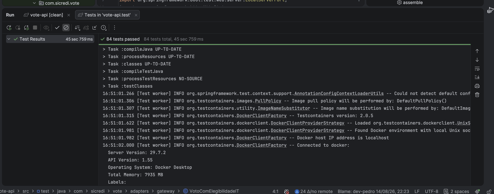

---

## 8. Performance (bônus 2)

Script k6 em [`perf/k6-votos.js`](perf/k6-votos.js) para o cenário de 400 mil votos.

```bash
# pré: crie uma pauta e abra uma sessão com duração longa, pegue o PAUTA_ID
k6 run -e BASE_URL=http://localhost:8080 -e PAUTA_ID=<uuid> perf/k6-votos.js
```

O `p95` sai da execução do script (threshold configurado: `p(95)<500ms`). Uma execução local de
referência, com 100 VUs, 0% de falhas HTTP e p95 de 38,7 ms no registro de voto, está documentada
na seção 11. A escalabilidade de leitura é sustentada pelo índice `(pauta_id, opcao)` usado na
apuração (`GROUP BY`).

---

## 9. Observabilidade

- **Actuator:** `/actuator/health`, `/actuator/prometheus`, `/actuator/metrics`.
- **Métricas de negócio:** `vote.registrados` (votos aceitos) e `vote.recusados{motivo}`
  (`inelegivel` / `indisponivel`).
- **Prometheus local:** `http://localhost:9090`, com job `vote-api` coletando
  `http://app:8080/actuator/prometheus` dentro da rede Docker.
- **Grafana local:** `http://localhost:3000`, login `admin` / `admin`, com datasource Prometheus
  e dashboard `Vote API` provisionados automaticamente.
- **Correlation-id:** cabeçalho `X-Correlation-Id` (gerado se ausente) propagado no log via MDC
  (`%X{correlationId}`). Exceções de elegibilidade **não** têm a causa logada (evita CPF em log).

O dashboard inicial mostra votos registrados, votos recusados por motivo, requisições HTTP,
latência HTTP, memória/threads JVM e uptime do processo. As métricas brutas podem ser verificadas
em `http://localhost:8090/actuator/prometheus`.

---

## 10. Versionamento da API (bônus 3)

**Estratégia:** versionamento por **URI** — todos os recursos sob `/api/v1`. É explícito,
cacheável, fácil de rotear e visível na documentação.

**Argumento server-driven (o diferencial deste projeto):** como as telas são entregues pelo
servidor com as **URLs de callback embutidas**, o app mobile **não faz hard-code de rotas** — ele
apenas segue a `url` que recebeu. Isso desloca o controle da versão para o servidor: uma nova
versão de um recurso pode ser introduzida (`/api/v2/...`) e o BFF de telas passa a apontar para ela
mantendo o **contrato da tela** (o formato do Anexo 1) estável. O cliente evolui sem release,
porque nunca conheceu a rota — só o formato da tela. Convivência de `v1`/`v2` fica trivial, e a
depreciação é gradual (as telas deixam de apontar para a versão antiga).

---

## 11. Desempenho e extras

Além do fluxo principal de votação, o projeto recebeu uma camada prática de evidências operacionais:
documentação Swagger para a API de domínio e para as telas server-driven, teste de carga com k6 e
observabilidade local com Prometheus e Grafana. A intenção foi deixar demonstrável não só que a regra
de negócio funciona, mas também como o serviço se comporta sob carga e como poderia ser acompanhado
em produção.

### Evidências do entregável

O material foi organizado para facilitar a avaliação do desafio: código-fonte, Gradle wrapper,
composes, dashboard, scripts de performance e documentação ficam juntos no pacote de entrega.

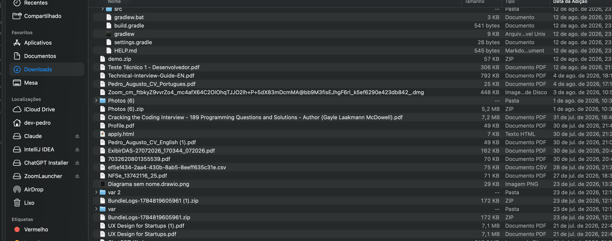

### Documentação dos contratos

O Swagger separa os contratos da API de domínio dos endpoints de telas. A API de domínio cobre o
cadastro de pautas, abertura de sessões, registro de voto e consulta de resultado; já a camada de
telas expõe o fluxo server-driven que o cliente mobile pode interpretar sem conhecer rotas fixas.

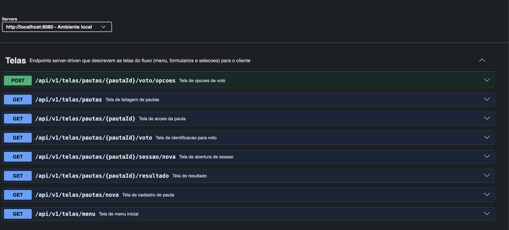

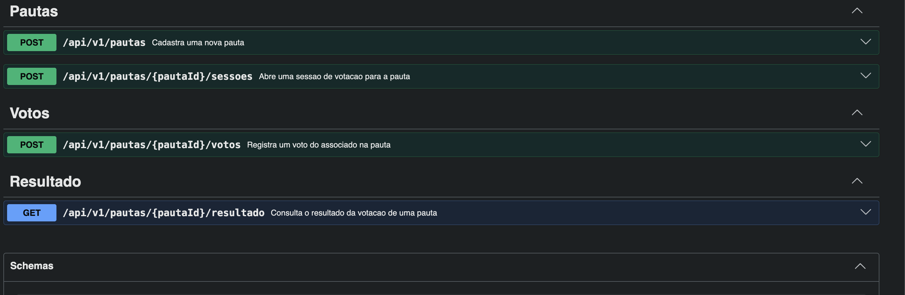

### Teste de carga

A execução local do k6 registrou 400.000 votos com 100 VUs, 100% dos checks concluídos com sucesso,
0% de falha HTTP e p95 de 38,7 ms para o registro de voto nesta amostra. Isso complementa o script
[`perf/k6-votos.js`](perf/k6-votos.js) e mostra o comportamento do endpoint crítico sob alta vazão.

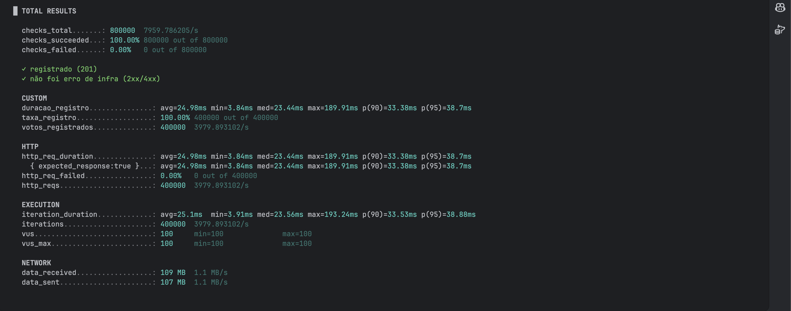

### Observabilidade

O dashboard `Vote API` cruza métricas de negócio (`vote.registrados` e `vote.recusados{motivo}`) com
sinais técnicos de HTTP, JVM, HikariCP, uptime e Resilience4j. Durante a carga, os painéis ajudam a
acompanhar disponibilidade do target Prometheus, vazão por rota e status, latência média, p95/p99,
uso de heap, threads, saturação do pool de conexões e estado do circuit breaker de elegibilidade.
Também deixei seis alertas provisionados como base para operação com on-call em produção: serviço
fora do ar, taxa de erro 5xx, p95 alto no voto, circuit breaker de elegibilidade aberto, saturação
do pool HikariCP e uso elevado de heap.

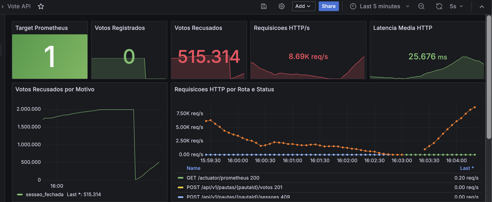

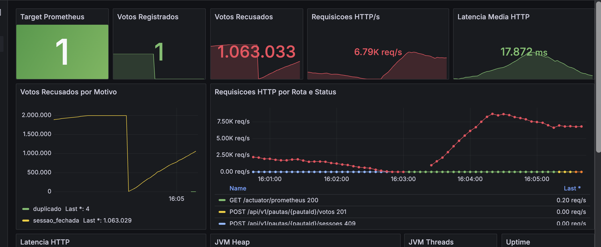

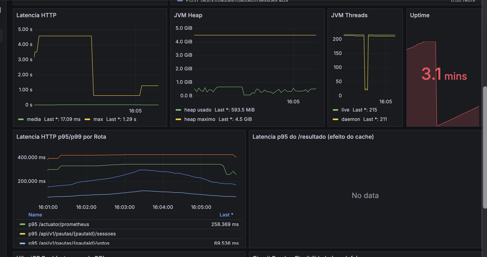

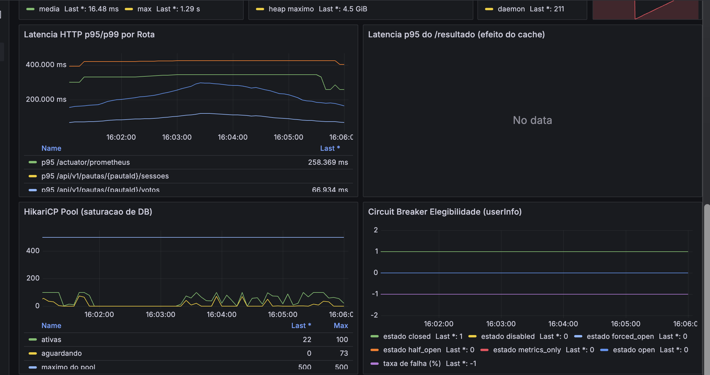

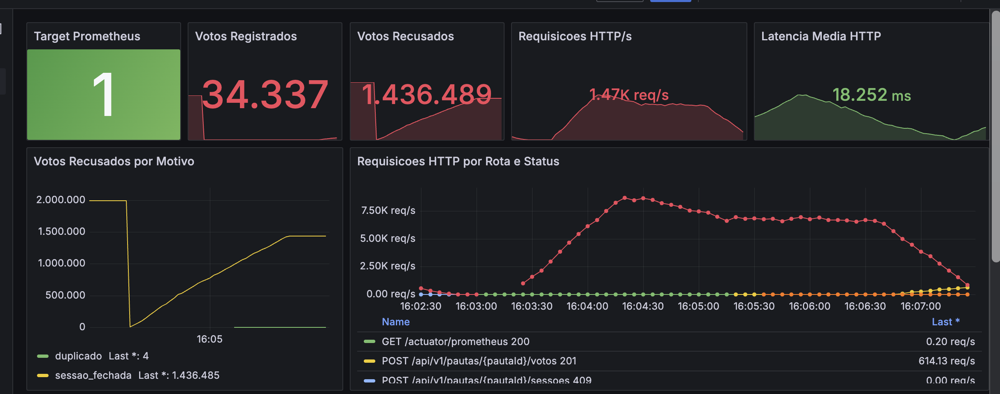

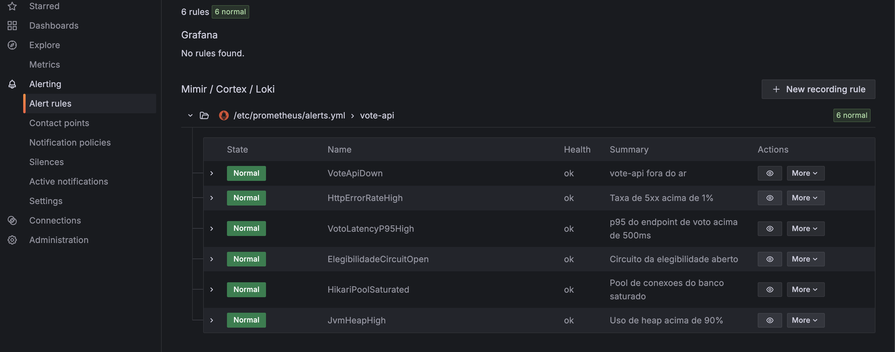
